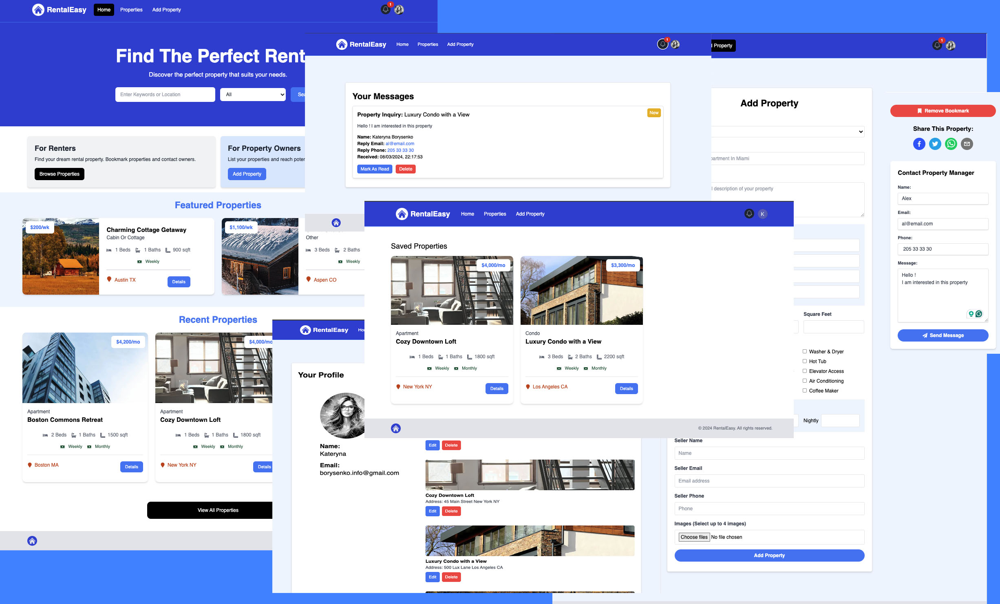

# Rental Easy

_Rental Easy_ is a comprehensive web application designed to simplify the process of finding your next rental property. With a user-friendly interface and a range of features, Rental Easy aims to streamline the rental property search experience.



## Features

- **User Authentication:** Users can authenticate using their Google accounts through Next Auth, ensuring a secure and convenient login process.
- **User Authorization:** Rental Easy implements user authorization to manage user permissions and access levels effectively.
- **Route Protection:** Routes within the application are protected, ensuring that only authorized users can access certain pages and features.
- **User Profile:** Users have personalized profiles where they can manage their listings, preferences, and saved properties.
- **Property Listing CRUD:** Rental Easy enables users to create, read, update, and delete property listings, providing flexibility and control over property information.
- **Property Image Upload:** Users can upload multiple images for each property listing, enhancing the visual appeal and comprehensiveness of property details.
- **Property Search:** A robust search functionality allows users to search for rental properties based on various criteria such as location, price range, and amenities.
- **Internal Messages:** Users can communicate internally within the platform, with unread message notifications to ensure prompt responses.
- **Photoswipe Image Gallery:** The application incorporates a user-friendly image gallery using Photoswipe, enhancing the browsing experience for property images.
- **Mapbox Maps:** Interactive maps powered by Mapbox provide users with a visual representation of property locations and nearby amenities.
- **Toast Notifications:** Rental Easy utilizes toast notifications to provide users with real-time updates and alerts.
- **Property Bookmarking:** Users can bookmark or save properties for future reference, facilitating easy access to preferred listings.
- **Property Sharing:** Integration with social media platforms allows users to share property listings with their network effortlessly.
- **Loading Spinners:** Loading spinners are implemented throughout the application to provide users with visual feedback during data retrieval and processing.
- **Responsive Design:** The application is built with Tailwind CSS, ensuring responsiveness across various devices and screen sizes.
- **Custom 404 Page:** A custom 404 error page enhances the user experience by providing helpful navigation options in case of a page not found error.

## Technologies Used

Rental Easy uses the following technologies:

- [Next.js](https://nextjs.org/)
- [React](https://reactjs.org/)
- [Tailwind CSS](https://tailwindcss.com/)
- [MongoDB](https://www.mongodb.com/)
- [Mongoose](https://mongoosejs.com/)
- [NextAuth.js](https://next-auth.js.org/)
- [React Icons](https://react-icons.github.io/react-icons/)
- [Photoswipe](https://photoswipe.com/)
- [Cloudinary](https://cloudinary.com/)
- [Mapbox](https://www.mapbox.com/)
- [React Map GL](https://visgl.github.io/react-map-gl/)
- [React Geocode](https://www.npmjs.com/package/react-geocode)
- [React Spinners](https://www.npmjs.com/package/react-spinners)
- [React Toastify](https://fkhadra.github.io/react-toastify/)
- [React Share](https://www.npmjs.com/package/react-share)

## Getting Started

### Prerequisites

- Node.js version 18 or higher
- MongoDB Atlas account and a cluster. Sign up and create a cluster at [MongoDB](https://www.mongodb.com/)
- Cloudinary account. Sign up at [Cloudinary](https://cloudinary.com/)
- Google console account. Sign up at [Google Cloud](https://console.cloud.google.com/)
- Mapbox account. Sign up at [Mapbox](https://www.mapbox.com/)

### Install Dependencies

```bash
npm install
```

### Run the Development Server

```bash
npm run dev
```

Open [http://localhost:3000](http://localhost:3000) with your browser to see the result.
